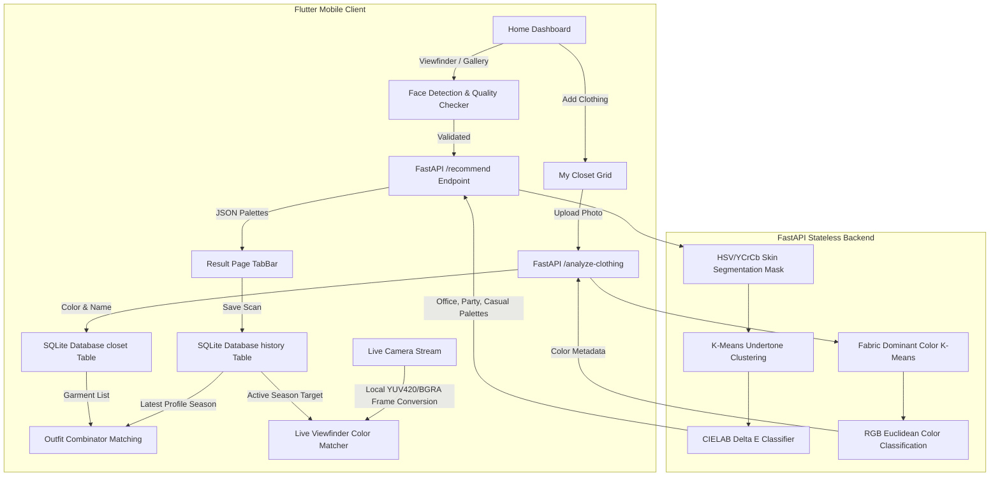

<!-- Hero Banner -->
<p align="center">
  
</p>

<!-- Project Name & Badges -->
<h1 align="center">StyleTone AI</h1>
<p align="center">
  <strong>Your AI-Powered Personal Stylist. Effortless outfits, custom-curated for your natural skin tones, with a virtual closet and real-time color matcher.</strong>
</p>

<p align="center">
  
  
  
  
  
  
</p>

---

## 📥 Download & Install

Download the compiled app package directly to your Android device from the platforms below:

<p align="center">
  <a href="https://github.com/Ganesh1110/StyleTone-AI/releases">
    
  </a>
</p>

---

## 🌟 Key Features

StyleTone AI is a private, offline-first personal styling companion. It uses computer vision, on-device AI face verification, professional color theory, and local SQLite data persistence to guide your style journey.

### 🎨 1. Personal Stylist Scanner (v1.0.0 / v1.5.0)

- 🧠 **CIELAB Delta E Seasonal Classification**: Computes color distances between skin tones and 4 seasonal color families (Spring, Summer, Autumn, Winter) with precise match confidence metrics.
- 🧼 **HSV/YCrCb Skin Segmentation**: Isolates pure skin pixels on the backend—filtering out hair, eyebrows, lips, eyes, and background for a 100% precise color match.
- 🎙️ **Offline Phonemic Text-to-Speech**: An offline speech synthesizer (`flutter_tts`) reads stylist tips aloud using local device voices, protecting your privacy.
- 📸 **On-Device Face Quality Checker**: Validates face alignment, lighting, and frame coverage using Google ML Kit (`google_mlkit_face_detection`) prior to upload.

### 👔 2. Premium Experience & Social Sharing (v2.0.0)

- ⚡ **One-Scan Multi-Occasion Dashboard**: Scans once and returns customized palettes for three occasions (**Office**, **Party**, and **Casual**) simultaneously.
- 📊 **Interactive Color Swatches Sheets**: Tap any swatch circle to slide up a bottom sheet detailing HEX values, RGB coordinates, and tailored garment pairing rules.
- 📤 **Native Screenshot Card Sharing**: Captures styling reports using a `RepaintBoundary` and launches native share sheets to share your palettes on WhatsApp, Instagram, or email.

### 👚 3. My Virtual Closet & Outfit Combinator (v2.5.0)

- 📁 **Local Virtual Closet**: Take photos of clothes in your wardrobe and save them categorized as **Tops**, **Bottoms**, **Outerwear**, **Shoes**, or **Accessories**.
- 🤖 **AI Clothing Color Extractor**: Uses K-Means color clustering to analyze uploaded garment fabrics and automatically tags them with color names (e.g. _Tomato Red_, _Olive Green_).
- 🧩 **Smart Outfit Combinator**: Measures RGB Euclidean color distance between your closet items and your active seasonal palette to suggest complete outfits from your own clothes with matching scores (e.g., _94% Match_).

### 🔍 4. Live Viewfinder Color Matcher (v3.0.0)

- 🎥 **On-Device Real-Time Analyzer**: Point your camera at any physical garment in a store. The app converts camera stream frames (YUV420 on Android, BGRA on iOS) locally in Dart at 30 FPS.
- 🎯 **Target Reticle Overlay**: Renders a circular targeting reticle in the middle of the camera feed to lock onto fabric colors.
- 🔥 **Instant Match Score**: Compares the live target color against your personal season colors to display a real-time match gauge (e.g., _Avoid Color_ vs. _Perfect Match! 🌟_).

---

## 📐 Scientific Color Analysis Engine

The FastAPI backend uses a **CIELAB Delta E ($\Delta E$) color difference classifier** to identify your seasonal skin category:

1. **BGR to LAB Conversion**:
   BGR coordinates are mapped to the $L^*a^*b^*$ color space. Unlike RGB, CIELAB is designed to represent human perception, where equal distance represents equal perceptual difference.
2. **Delta E Calculation**:
   The distance between the detected skin color and predefined seasonal anchor centers (representing Spring, Summer, Autumn, and Winter skin profiles) is calculated using the Euclidean distance:

   $$\Delta E^* = \sqrt{(\Delta L^*)^2 + (\Delta a^*)^2 + (\Delta b^*)^2}$$

3. **Similarity Softmax**:
   Distance scores are normalized using an exponential decay function to compute a precise **Match Confidence Percentage**.
4. **Explainable AI Output**:
   The system details your undertones (e.g., warm golden/peach, cool rosy/pink) and lightness depth (e.g., fair, medium, rich) to justify the seasonal classification.

---

## 🏗️ System Architecture



---

## 📂 Project Structure

```text
StyleTone-AI/
├── assets/                     # App media assets
│   └── images/                 # App logo and repository banner
├── backend_api/                # FastAPI Python Backend
│   ├── api/                    # Server routing entry point (index.py)
│   ├── color_matrix.json       # Seasonal palettes configurations
│   ├── image_processor.py      # Skin segmentation & Delta E classifier algorithms
│   └── start.sh                # Local backend startup script
├── lib/                        # Flutter Application Source
│   ├── models/                 # Data parsing objects (HistoryItem, ClosetItem, ColorRecommendation)
│   ├── screens/                # UI screens (Home, Closet, Outfit Combinator, Live Matcher, Result)
│   └── services/               # Services (ApiService, DatabaseHelper, TtsService, ProfileService)
├── bump_version.py             # Automated version bumper script (Frontend only)
├── build_apk.sh                # Automated release APK builder script
├── RELEASE_GUIDE.md            # Version release checklist and instructions
└── pubspec.yaml                # Flutter project configuration & assets declaration
```

---

## 🚀 Getting Started

### Prerequisites

- [Flutter SDK](https://docs.flutter.dev/get-started/install) (v3.0.0+)
- [Python](https://www.python.org/downloads/) (v3.10+)

### 1. Set Up the Backend Server

```bash
# Navigate to the backend directory
cd backend_api

# Run the startup script (creates venv, installs requirements.txt, and starts uvicorn)
chmod +x start.sh
./start.sh
```

The server will start running locally at `http://localhost:8000`.

### 2. Set Up the Flutter App

To run on an **Android Emulator** or **iOS Simulator**:

1. Ensure the backend URL in `lib/services/api_service.dart` points to your target server:
   - For Android Emulator: Use `http://10.0.2.2:8000`
   - For iOS Simulator: Use `http://localhost:8000`
   - For Production: Use `https://style-tone-ai.vercel.app`
2. Run the application:

   ```bash
   # Get dependencies
   flutter pub get

   # Run on your active device/emulator
   flutter run
   ```

---

## 🛠️ Developer Scripts

Refer to [RELEASE_GUIDE.md](file:///Users/ganeshjayaprakash/WorkSpace/Mine/StyleTone-AI/RELEASE_GUIDE.md) for full instructions.

- **Bump Version Name/Code**:
  ```bash
  python bump_version.py
  ```
- **Compile Release APK binaries (standard & split architecture)**:
  ```bash
  ./build_apk.sh
  ```

---

## 📄 License

This project is licensed under the MIT License - see the [LICENSE](LICENSE) file for details.
