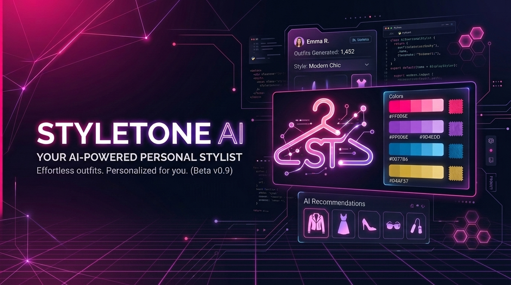
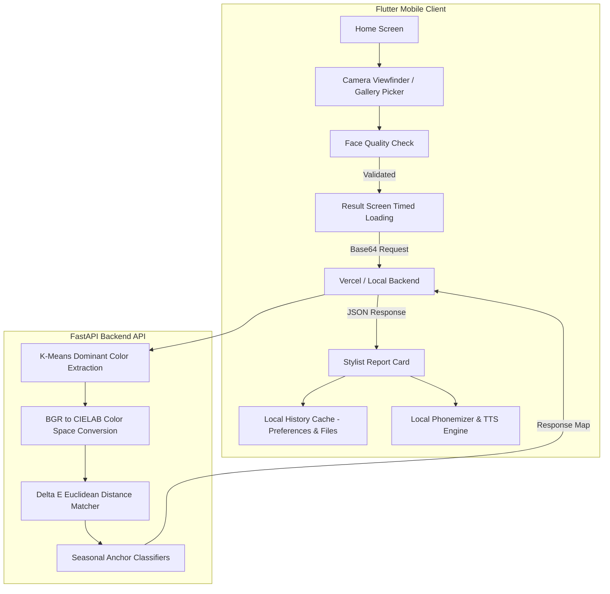

<!-- Hero Banner -->
<p align="center">
  
</p>

<!-- Project Name & Badges -->
<h1 align="center">StyleTone AI</h1>
<p align="center">
  <strong>Your AI-Powered Personal Stylist. Effortless outfits, custom-curated for your natural skin tones.</strong>
</p>

<p align="center">
  
  
  
  
  
</p>

---

<!-- Download & Install Section -->
<h2 align="center">📥 Download & Install</h2>
<p align="center">
  <strong>Available for Android 😍</strong>
</p>

<p align="center">
  <a href="https://github.com/Ganesh1110/StyleTone-AI/releases">
    
  </a>
  &nbsp;&nbsp;
  <a href="https://sourceforge.net/projects/styletone-ai/files/app-release.apk/download">
    
  </a>
</p>

<p align="center">
  <a href="https://apt.izzysoft.de/">
    
  </a>
</p>

---

## 🌟 Key Features

StyleTone AI is a cross-platform mobile assistant that acts as a personal styling consultant. It uses computer vision, on-device AI quality check, and professional color theory to detect your seasonal color family and recommend customized outfits.

*   🧠 **CIELAB Delta E Seasonal Classification**: Perceptually uniform skin tone distance-matching against 4 seasonal color families (Spring, Summer, Autumn, Winter).
*   🎙️ **Offline Phonemic Text-to-Speech**: An offline speech synthesis engine that reads stylist tips aloud using local phonetic compilation, ensuring privacy and data savings.
*   🔄 **Local Storage & History Cache**: Save, browse, and delete your styling reports offline. Includes face thumbnail persistence in app document storage.
*   📸 **AI Face & Quality Checker**: Real-time on-device facial feature validation (`google_ml_kit`) for gallery image picks to guarantee perfect lighting and alignment before color analysis.
*   🛡️ **Viewfinder Mask Overlay**: Custom camera viewfinder oval mask to assist in taking perfectly aligned selfies.

---

## 📸 Application Screenshots

<p align="center">
  <i>Save your emulator screenshots to <code>assets/screenshots/</code> directory to display them here.</i>
</p>

| 1. Onboarding (Face Scan) | 2. Onboarding (Palettes) | 3. Onboarding (TTS & Privacy) |
| :---: | :---: | :---: |
|  |  |  |
| **4. Main Dashboard** | **5. Quality Checker** | **6. Color Report** |
|  |  |  |

---

## 📐 Scientific Color Analysis Engine

StyleTone AI doesn't just guess your colors. The Python backend runs a **CIELAB Delta E ($\Delta E$) color difference classifier** to identify your seasonal tones:

1. **BGR to LAB Conversion**:
   The BGR skin color is converted to the $L^*a^*b^*$ color space. Unlike RGB, CIELAB is designed to approximate human vision, where equal distance represents equal perceptual difference.
2. **Delta E Calculation**:
   The distance between the detected skin color and predefined seasonal anchor centers (representing Spring, Summer, Autumn, and Winter skin families) is calculated using the Euclidean distance:
   
   $$\Delta E^* = \sqrt{(\Delta L^*)^2 + (\Delta a^*)^2 + (\Delta b^*)^2}$$
   
3. **Similarity Softmax**:
   Distance scores are normalized using an exponential decay function to compute a precise **Match Confidence Percentage**.
4. **Explainable AI Output**:
   The system details the undertones (e.g. warm golden/peach, cool rosy/pink) and lightness depth (e.g. porcelain, fair, medium, rich) to justify the stylist's diagnosis.

---

## 🏗️ System Architecture



---

## 📂 Project Structure

```text
StyleTone-AI/
├── assets/                     # App media assets
│   ├── images/                 # App logo and repository banner
│   └── screenshots/            # Repository screenshot gallery
├── backend_api/                # FastAPI Python Backend
│   ├── api/                    # Server routing entry point
│   ├── color_matrix.json       # Seasonal palettes matrix configurations
│   ├── image_processor.py      # CIELAB Delta E classifier algorithm
│   └── start.sh                # Local backend startup script
├── lib/                        # Flutter Application Source
│   ├── models/                 # Data parsing objects (HistoryItem, ColorRecommendation)
│   ├── screens/                # UI screens (Home, Onboarding, History, Preview, Result)
│   └── services/               # Services (ApiService, HistoryService, Phonemizer, TtsService)
└── pubspec.yaml                # Flutter project configuration & assets declaration
```

---

## 🚀 Getting Started

### Prerequisites
*   [Flutter SDK](https://docs.flutter.dev/get-started/install) (v3.0.0+)
*   [Python](https://www.python.org/downloads/) (v3.10+)

### 1. Set Up the Backend Server

```bash
# Navigate to the backend directory
cd backend_api

# Run the startup script (creates venv, installs requirements.txt, and starts uvicorn)
chmod +x start.sh
./start.sh
```
The server will start running locally at `http://localhost:8000`.

### 2. Set Up the Flutter App

To run on an **Android Emulator** or **iOS Simulator**:

1. Ensure the backend URL in `lib/services/api_service.dart` points to your target server:
   - For Android Emulator: Use `http://10.0.2.2:8000`
   - For iOS Simulator: Use `http://localhost:8000`
   - For Production: Use `https://style-tone-ai.vercel.app`
2. Run the application:
   ```bash
   # Get dependencies
   flutter pub get

   # Run on your active device/emulator
   flutter run
   ```

---

## 📄 License
This project is licensed under the MIT License - see the [LICENSE](LICENSE) file for details.
